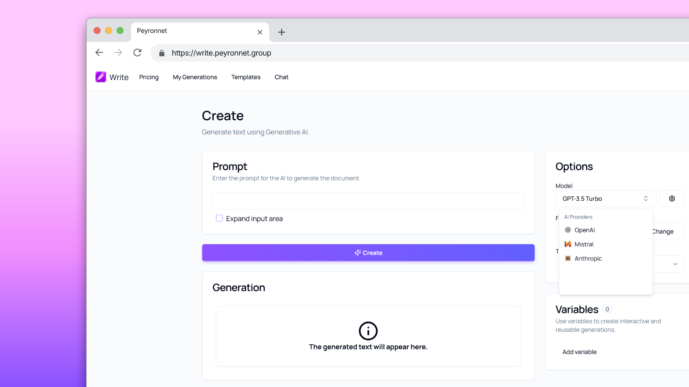
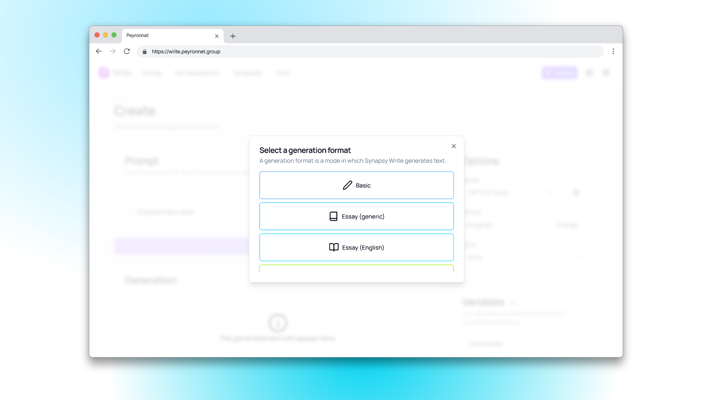
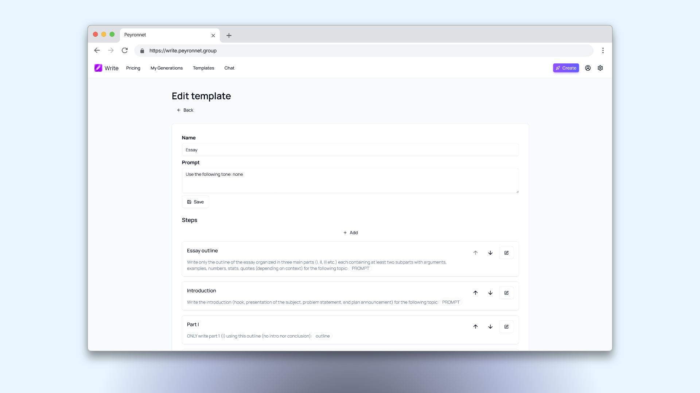
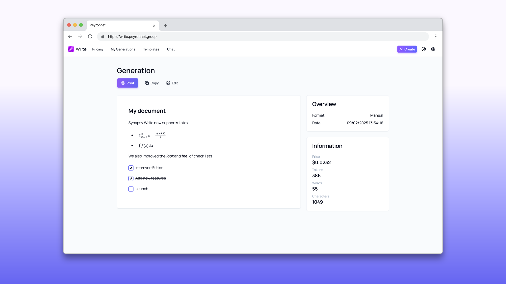
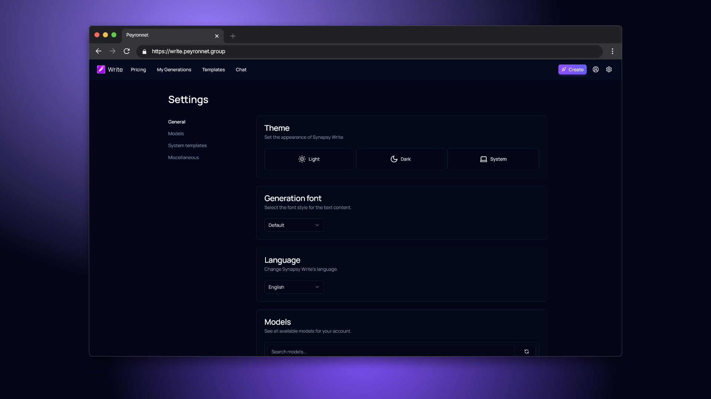

[](https://app.netlify.com/sites/synapsy-write/deploys)


<br />
<p align="center">
  <a href="https://github.com/synapsy-ai/write">
    
  </a>
  <h1 align="center">Synapsy Write</h1>

  <p align="center">
    A new way to create text, powered by AI.
    <br />
    <a href="https://write.peyronnet.group"><strong>Launch »</strong></a>
    <br />
    <a href="https://github.com/synapsy-ai/write/issues/new?assignees=&labels=bug&template=bug-report.yml&title=%5BBug%5D+">Report Bug</a>
    ·
    <a href="https://github.com/synapsy-ai/write/issues/new?assignees=&labels=enhancement&template=feature-request.yml&title=%5BEnhancement%5D+">Request Feature</a>
    ·
    <a href="https://github.com/synapsy-ai/write/issues?q=is%3Aopen+is%3Aissue+label%3Abug">Known Issues</a>

  </p>
</p>

## Overview

Synapsy Write is a Next.js web application that leverages the power of advanced AI models from various providers to assist users in effortlessly generating text content. Whether you need paragraphs for your website, blog posts, essays, or any other written content, Synapsy Write has got you covered. With a user-friendly interface and advanced AI capabilities, creating text has never been easier!

## Features

### Advanced AI Models



Synapsy Write harnesses the power of advanced AI models from multiple providers, including OpenAI, Mistral, and Anthropic. These models are at the forefront of natural language processing, delivering high-quality text generation based on your input. Whether you're looking for precise, informative paragraphs or creative, engaging narratives, these state-of-the-art models provide reliable and contextually accurate content, ensuring your text meets the highest standards of quality and coherence.

### Versatile Output



One of the standout features of Synapsy Write is its versatility in content creation. With just a few clicks, you can generate various forms of written content such as paragraphs, blog posts, essays, and more. This flexibility allows users to produce different types of content without needing multiple tools, making it an all-in-one solution for your writing needs. The AI's adaptability ensures that the content generated is suitable for various purposes, from professional documentation to creative storytelling.

### Templates



The template feature in Synapsy Write allows users to create and utilize custom templates for generating complex documents. This functionality enables you to define the structure and format of your documents, breaking down the generation process into manageable parts and assigning different models to specific sections. By doing so, you ensure better output quality and coherence, especially for lengthy or detailed documents. This feature is ideal for users who frequently produce similar types of documents and want to streamline their workflow.

### Conversation


Synapsy Write includes a conversation mode that mimics the interactive experience of ChatGPT. This feature allows users to engage in a dialogue with the AI, providing a more dynamic and interactive content generation process. Additionally, users can customize the system prompt, tailoring the AI's responses to better fit their needs. This adaptability makes the conversation feature a powerful tool for brainstorming, refining ideas, or simply exploring different perspectives on a topic.

### Easy to Use



The intuitive user interface of Synapsy Write ensures that even non-technical users can get started quickly and efficiently. The design is user-centric, prioritizing ease of use and accessibility. Clear instructions, straightforward navigation, and responsive design elements all contribute to a seamless user experience. Whether you're a novice or an experienced user, Synapsy Write's interface is designed to facilitate effortless interaction with its powerful AI capabilities.

### Highly Customizable



Tailor Synapsy Write to your specific needs with a range of customization options. Select your preferred AI models, adjust text output length, and customize system prompts to suit your writing style and requirements. This level of personalization ensures that Synapsy Write adapts to you, providing a more effective and enjoyable writing experience.

## Getting Started

Ready to elevate your writing with Synapsy Write? Follow these simple steps to get started:

1. **Visit the Website**: Head over to [https://write.peyronnet.group](https://write.peyronnet.group) to access the application.

2. **Choose Your Content Type**: Select the type of text you want to generate, whether it's paragraphs, blog posts, essays, or something else.

3. **Generate Your Text**: Click the "Create" button, and let Synapsy Write's advanced AI models work their magic to generate your content.

4. **Review Your Generations**: Access your previous generations by clicking on the "My generations" button in the navigation bar.

## System Requirements

- Modern web browser (Chrome, Firefox, Safari, Edge, etc.)
- Internet connection

## Contributing

We welcome contributions to enhance Synapsy Write! If you'd like to contribute, please follow these steps:

1. **Fork the Repository**: Click the 'Fork' button at the top right of this page.
2. **Clone Your Fork**:
   ```sh
   git clone https://github.com/yourusername/synapsy-write.git
   ```
3. **Create a Branch**:
   ```sh
   git checkout -b feature/your-feature-name
   ```
4. **Make Your Changes**: Implement your feature or fix.
5. **Commit Your Changes**:
   ```sh
   git commit -m 'Add feature/your-feature-name'
   ```
6. **Push to Your Branch**:
   ```sh
   git push origin feature/your-feature-name
   ```
7. **Open a Pull Request**: Submit your pull request for review.

## Using Dev Containers for Local Development

To facilitate a consistent development environment, the Synapsy Write project includes support for development containers. This allows you to quickly set up a fully functional development environment with all necessary dependencies and tools.

### Prerequisites

Before you begin, ensure you have the following installed:

- [Docker](https://www.docker.com/get-started) (to run containers)
- [Visual Studio Code](https://code.visualstudio.com/) (for a powerful code editor)
- [Remote - Containers extension for VS Code](https://marketplace.visualstudio.com/items?itemName=ms-vscode-remote.remote-containers)

### Setting Up the Dev Container

Follow these steps to set up and use the development container:

1. **Clone the Repository**:

   ```bash
   git clone https://github.com/synapsy-ai/write.git
   cd write
   ```

2. **Open the Project in VS Code**:
   - Open Visual Studio Code.
   - Use the `File > Open Folder...` menu to open the `write` folder you just cloned.

3. **Open the Dev Container**:
   - Open the Command Palette (F1) and select `Remote-Containers: Open Folder in Container...`.
   - Select the root folder of your project (`write`).

4. **Wait for the Container to Build**:
   - VS Code will automatically build the development container using the configuration in the `.devcontainer` folder.
   - This may take a few minutes the first time as it installs all necessary dependencies.

5. **Start Developing**:
   - Once the container is ready, you can start coding immediately.
   - The container comes pre-installed with necessary extensions such as Prettier and Tailwind CSS IntelliSense.

## License

Synapsy Write is available under the [MIT License](LICENSE). Feel free to use, modify, and distribute the code as needed, in compliance with the license terms.
